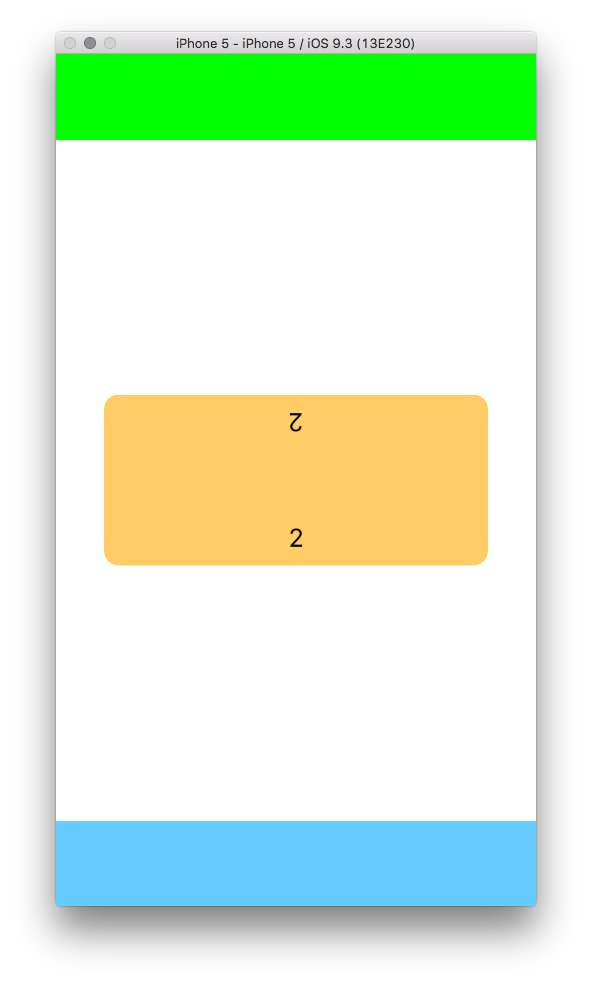
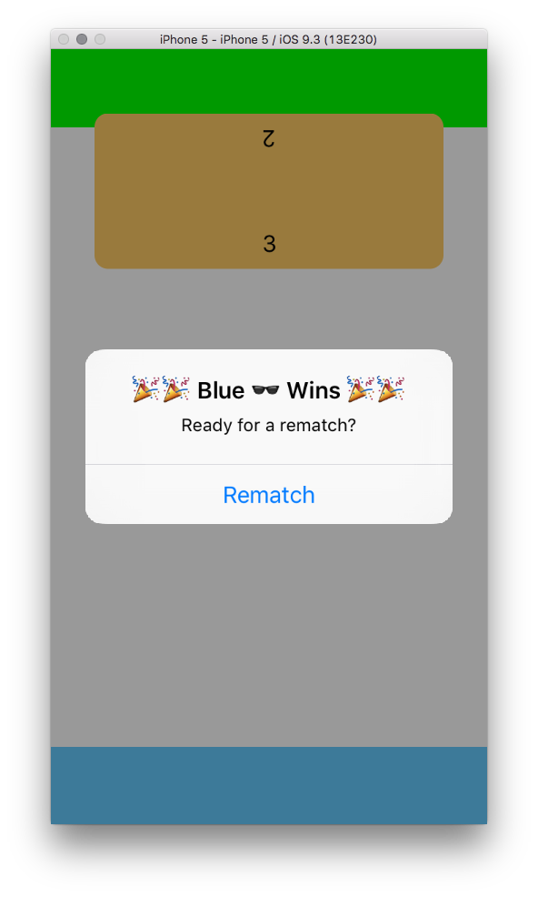

A simple 2 player iOS game build using only UIKit.

The players move the middle block by pushing on their respective buttons. When the block has been pushed all the way to the other end, the player gets a point.

There are some interesting things to see in this project. Spring Animations, Affine Transformations, and How to display upside down text.

